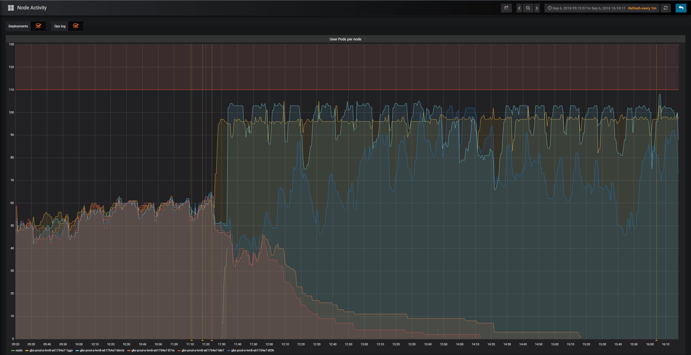

(optimization)=

# Optimizations

This page contains information and guidelines for improving the reliability,
flexibility and stability of your JupyterHub deployment. Many of the settings
described is only purposeful for a better autoscaling experience.

To summarize, for a good autoscaling experience, we recommend you to:

- Enable the _continuous image puller_, to prepare added nodes for arriving
  users.
- Enable _pod priority_ and add _user placeholders_, to scale up nodes ahead of
  real users' arrivals.
- Enable the _user scheduler_, to pack users tight on some nodes and let other
  nodes become empty and scaled down.
- Set up an autoscaling node pool and dedicate it to user pods by _tainting_ the
  node and requiring user pods, which _tolerate_ the nodes' taint, to schedule
  on these nodes. This way, only user pods can then block scale down.
- Set appropriate user resource _requests_ and _limits_, to allow a reasonable
  amount of users to share a node.

A reasonable final configuration for efficient autoscaling could look something
like this:

```yaml
scheduling:
  userScheduler:
    enabled: true
  podPriority:
    enabled: true
  userPlaceholder:
    enabled: true
    replicas: 4
  userPods:
    nodeAffinity:
      matchNodePurpose: require

cull:
  enabled: true
  timeout: 3600
  every: 300

# The resources requested is very important to consider in
# relation to your machine type. If you have a n1-highmem-4 node
# on Google Cloud for example you get 4 cores and 26 GB of
# memory. With the configuration below you would  be able to have
# at most about 50 users per node. This can be reasonable, but it
# may not be, it will depend on your users. Are they mostly
# writing and reading or are they mostly executing code?
singleuser:
  cpu:
    limit: 4
    guarantee: 0.05
  memory:
    limit: 4G
    guarantee: 512M
```

(pulling-images-before-users-arrive)=

## Pulling images before users arrive

If a user pod is scheduled on a node requesting a Docker image that isn't
already pulled onto that node, the user will have to wait for it. If the image
is large, the wait can be 5 to 10 minutes. This commonly occurs in two
situations:

1. A new single-user image is introduced (`helm upgrade`)

   With the _hook-image-puller_ enabled (the default), the user images being
   introduced will be pulled to the nodes before the hub pod is updated to
   utilize the new image. The name hook-image-puller is a technical name
   referring to how a [Helm
   hook](https://helm.sh/docs/topics/charts_hooks/) is used to accomplish
   this, a more informative name would have been _pre-upgrade-image-puller_.

   **NOTE**: With this enabled your `helm upgrade` will take a long time if you
   introduce a new image as it will wait for the pulling to complete. We
   recommend that you add `--timeout 10m0s` or similar to your `helm upgrade`
   command to give it enough time.

   The hook-image-puller is enabled by default. To disable it, use the
   following snippet in your `config.yaml`:

   ```yaml
   prePuller:
     hook:
       enabled: false
   ```

2. A node is added (Cluster Autoscaler)

   The amount of nodes in a Kubernetes cluster can increase, either by manually
   scaling up the cluster size or by a cluster autoscaler. As new nodes will
   come fresh without any images on their disks, a user pod arriving to this
   node will be forced to wait while the image is pulled.

   With the _continuous-image-puller_ enabled (**enabled** by default), the user's
   container image will be pulled when a new node is added. New nodes can for
   example be added manually or by a cluster autoscaler. The continuous
   image-puller uses a
   [daemonset](https://kubernetes.io/docs/concepts/workloads/controllers/daemonset/)
   to force Kubernetes to pull the user image on all nodes as soon as a node is
   present.

   The continuous-image-puller is enabled by default. To disable it, use the
   following snippet in your `config.yaml`:

   ```yaml
   prePuller:
     continuous:
       # NOTE: if used with a Cluster Autoscaler, also add user-placeholders
       enabled: false
   ```

   It is important to realize that if the continuous-image-puller together with
   a Cluster Autoscaler (CA) won't guarantee a reduced wait time for users. It
   only helps if the CA scales up before real users arrive, but the CA will
   generally fail to do so. This is because it will only add a node if one or
   more pods won't fit on the current nodes but would fit more if a node is
   added, but at that point users are already waiting. To scale up nodes ahead
   of time we can use [user-placeholders](scaling-up-in-time-user-placeholders).

(images-that-will-be-pulled)=

### The images that will be pulled

The hook-image-puller and the continuous-image-puller has various sources
influencing what images they will pull, as it does in order to prepare nodes
ahead of time that may need images. These sources are all found in the values
provided with the Helm chart (that can be overridden with `config.yaml`) under
the following paths:

#### Relevant image sources

- `singleuser.image`
- `singleuser.profileList[].kubespawner_override.image`
- `singleuser.extraContainers[].image`
- `prePuller.extraImages.someName`

#### Additional sources

- `singleuser.networkTools.image`
- `prePuller.pause.image`

For example, with the following configuration, three images would be pulled by
the image pullers in order to prepare the nodes that may end up using these
images.

```yaml
singleuser:
  image:
    name: jupyter/minimal-notebook
    tag: 2343e33dec46
  profileList:
    - display_name: "Minimal environment"
      description: "To avoid too much bells and whistles: Python."
      default: true
    - display_name: "Datascience environment"
      description: "If you want the additional bells and whistles: Python, R, and Julia."
      kubespawner_override:
        image: jupyter/datascience-notebook:2343e33dec46

prePuller:
  extraImages:
    my-other-image-i-want-pulled:
      name: jupyter/all-spark-notebook
      tag: 2343e33dec46
```

(efficient-cluster-autoscaling)=

## Efficient Cluster Autoscaling

A [_Cluster
Autoscaler_](https://github.com/kubernetes/autoscaler/tree/HEAD/cluster-autoscaler)
(CA) will help you add and remove nodes from the cluster. But the CA needs some
help to function well. Without help, it will both fail to scale up before users
arrive and scale down nodes aggressively enough without disrupting users.

(scaling-up-in-time-user-placeholders)=

### Scaling up in time (user placeholders)

A _Cluster Autoscaler_ (CA) will add nodes when pods don't fit on available
nodes but would fit if another node is added. But, this may lead to a long
waiting time for the pod, and as a pod can represent a user, it can lead to a
long waiting time for a user. There are now options to address this.

With Kubernetes 1.11+ (that requires Helm 2.11+), [Pod Priority and
Preemption](https://kubernetes.io/docs/concepts/scheduling-eviction/pod-priority-preemption/)
was introduced. This allows pods with higher priority to preempt / evict pods
with lower priority if that would help the higher priority pod fit on a node.

This priority mechanism allows us to add dummy users or _user-placeholders_ with
low priority that can take up resources until a real user with (higher priority)
requires it. At this time, the lower priority pod will get preempted to make
room for the high priority pod. This now evicted user-placeholder will now be
able to signal to the CA that it needs to scale up.

The user placeholders will have the same resources requests/limits as the Helm
chart is configured under `singleuser.cpu` and `singleuser.memory`. This means
that if you have three user placeholders running, real users will only need to
wait for a scale up if _more than three users arrive in an interval of time less
than it takes to make a node ready for use_, assuming these users didn't spawn
with adjusted resource requests as specified in `singleuser.profileList`.

To use three user placeholders for example, that can do their job thanks to pod
priority, add the following configuration:

```yaml
scheduling:
  podPriority:
    enabled: true
  userPlaceholder:
    # Specify three dummy user pods will be used as placeholders
    replicas: 3
```

For further discussion about user placeholders, see [@MinRK's excellent
post](https://discourse.jupyter.org/t/planning-placeholders-with-jupyterhub-helm-chart-0-8-tested-on-mybinder-org/213)
where he analyzed its introduction on mybinder.org.

```{important}
Further settings may be required for successful use of the pod
priority depending on how your cluster autoscaler is configured. This is known
to work on GKE, but we don't know how it works on other cloud providers or
kubernetes. See the [configuration reference](schema_scheduling.podPriority) for more details.
```

### Scaling down efficiently

Scaling up is the easy part, scaling down is harder. To scale down a node,
[certain technical
criteria](https://github.com/kubernetes/autoscaler/blob/HEAD/cluster-autoscaler/FAQ.md#what-types-of-pods-can-prevent-ca-from-removing-a-node)
need to be met. The central one is in order for a node to be scaled down, it
must be free from pods that aren't allowed to be disrupted. Pods that are not
allowed to be disrupted are, for example, real user pods, important system pods,
and some JupyterHub pods (without a permissive
[PodDisruptionBudget](https://kubernetes.io/docs/concepts/workloads/pods/disruptions/)).
Consider for example that many users arrive to your JupyterHub during the
daytime. New nodes are added by the CA. Some system pod ends up on the new nodes
along with the user pods for some reason. At night when the
[_culler_](culling-user-pods) has removed many inactive
pods from some nodes. They are now free from user pods but there is still a
single system pod stopping the CA from removing the node.

To avoid these scale down failures, we recommend using a _dedicated node pool_
for the user pods. That way, all the important system pods will run at one or a
limited set of nodes, so the autoscaling user nodes can scale from 0 to X and
back from X to 0.

This section about scaling down efficiently, will also explains how the _user
scheduler_ can help you reduce the failures to scale down due to blocking user
pods.

#### Using a dedicated node pool for users

To set up a dedicated node pool for user pods, we can use [_taints and
tolerations_](https://kubernetes.io/docs/concepts/scheduling-eviction/taint-and-toleration/).
If we add a taint to all the nodes in the node pool, and a toleration on the
user pods to tolerate being scheduled on a tainted node, we have practically
dedicated the node pool to be used only by user pods.

To make user pods schedule on a dedicated node for them, you need to do the
following:

1. Setup a node pool (with autoscaling), a certain label, and a certain taint.

   If you need help on how to do this, please refer to your cloud providers
   documentation. A node pool may be called a node group.

   - The label: `hub.jupyter.org/node-purpose=user`

     **NOTE**: Cloud providers often have their own labels, separate from
     kubernetes labels, but this label must be a kubernetes label.

   - The taint: `hub.jupyter.org/dedicated=user:NoSchedule`

     **NOTE**: You may need to replace `/` with `_` due cloud provider
     limitations. Both taints are tolerated by the user pods.

2. Make user pods require to be scheduled on the node pool setup above

   If you don't require the user pods to schedule on their dedicated node, you
   may fill up the nodes where the other software runs. This can cause a `helm upgrade` command to fail. For example, you may have run out of resources for
   non-user pods that cannot schedule on the autoscaling node pool as they need
   during a rolling update.

   The default setting is to make user pods _prefer_ to be scheduled on nodes
   with the `hub.jupyter.org/node-purpose=user` label, but you can also make it
   _required_ using the configuration below.

   ```yaml
   scheduling:
     userPods:
       nodeAffinity:
         # matchNodePurpose valid options:
         # - ignore
         # - prefer (the default)
         # - require
         matchNodePurpose: require
   ```

**NOTE**: If you end up _not_ using a dedicated node pool for users and want to
scale down efficiently, you will need to learn about PodDisruptionBudget
resources and do quite a bit more work in order to avoid ending up with almost
empty nodes not scaling down.

#### Disabling default tolerations

Some clusters may have a [PodTolerationRestriction admission-controller](https://kubernetes.io/docs/reference/access-authn-authz/admission-controllers/#podtolerationrestriction) running that will block Kubernetes objects that include tolerations outside of a specified whitelist. If your cluster has this controller running and you cannot update it to include the `hub.jupyter.org/dedicated` / `_dedicated` tolerations, then you can disable those across all the chart's pods by setting `scheduling.corePods.tolerations` and `scheduling.userPods.tolerations` to an empty list.

#### Using available nodes efficiently (the user scheduler)

If you have users starting new servers while the total number of active users
decreasing, how will you free up a node so it can be scaled down?

This is what the _user scheduler_ helps you with. The user scheduler's only task
is to schedule new user pods to the _most utilized node_. This can be compared
to the _default scheduler_ that instead always tries to schedule pods so the
_least utilized node_. Only the user scheduler would allow the underutilized
nodes to free up over time as the total amount of users decrease but a few users
still arrive.

**NOTE**: If you don't want to scale down the nodes you have, it would make more
sense to let the users spread out and utilize all available nodes. Only activate
the user scheduler if you have an autoscaling node pool.

To see the user scheduler in action, look at the following graph from the
mybinder.org deployment. The graph is from when the user scheduler was enabled
for the first time, it is showing the amount of user pods active on five
different nodes. When the user scheduler was enabled, two nodes were in time
freed up from user pods and scaled down.



To enable the user scheduler:

```yaml
scheduling:
  userScheduler:
    enabled: true
```

**NOTE**: For the user scheduler to work well, you need old user pods to shut
down at some point. Make sure to properly configure the
[_culler_](culling-user-pods).

## Balancing "guaranteed" vs "maximum" memory and CPU

You have the ability to [choose a "guarantee" and a "limit"](memory-cpu-limits) for both memory and CPU available to users.
This allows you to make a more efficient use of your cloud resources, but how do you choose the right "ratio" of "guaranteed / limit"?
Here is an example scenario to help you decide a strategy.

Consider a JupyterHub with 100G of RAM per node.
Users of the hub are expected to _occasionally_ use 20G each, so you begin by giving each of them a _guarantee_ of 20G of RAM.
This means that any time a user starts their session, 20G of RAM on the node is reserved for them.
Each node can fit 5 users (100G / 20G per user = 5 users).

However, you notice that in practice, most users have just 1G of RAM being used, and _very occasionally_ use the full 20G.
This means that your hub often has 80 to 90G of RAM _reserved but not used_.
You are paying for resources that you don't usually need.

Using resource _limits_ and _guarantees_, you can use your cloud resources more efficiently. Resource _limits_ define a maximum, while resource _guarantees_ define a minimum.
The ratio of these two numbers is the _limit to guarantee ratio_.
In the above case, your _limit to guarantee ratio_ is `1:1`.

If you set a _guarantee_ of 1GB and a _limit_ of 20GB then you have a _limit to guarantee ratio_ of `20:1`.
Your node will fit many more users on average.
When a user starts a session, if there is at least 1GB of RAM available on the node then their session will start there.
If not, a new node will be created (and your costs just went up).

However, say there are now 50 users on this node.
Technically, it is still well under the node's maximum allowed number, since each user only has a guarantee of 1G RAM and we have 100G total.
If 10 of those users suddenly load in a 10GB dataset, we've now requested `(10 * 10GB) + (40 * 1GB) = 140GB used RAM`.
Uh oh, we are now well over the 100GB limit, and user sessions will start crashing.
This is what happens when your _limit to guarantee ratio_ is too big.

The problem? Your user's behavior was not the right fit for your _limit to guarantee ratio_.
You should _increase_ the guaranteed amount of RAM for each user, so that in general fewer users will be on a given node, and they are less-likely to saturate that node's memory by asking for RAM all at once.

Choosing the right _limit to guarantee ratio_ ratio is an art, not a science.
We suggest **starting with a ratio of 2 to 1** and adjusting from there based on whether you run into problems on your hub.
For example, if the limit is 10GB, start with a guarantee of 5GB.
Use a service such as Prometheus + Grafana to monitor the memory usage over time, and use this to decide whether to adjust your ratio.

## Explicit memory and CPU allocated to core pods' containers

The Helm chart creates several k8s Pods that typically have one container
running in them, but sometimes more. In this section you are guided on how to
explicitly specify how much CPU and memory they are guaranteed via _requests_
and how much CPU and memory they are limited to via _limits_.

To complement this text, see [a related section in the Kubernetes
documentation](https://kubernetes.io/docs/concepts/configuration/manage-resources-containers/).

To decide what requests and limits to set, some background knowledge is
relevant:

1. Resource _requests_ guarantees a minimal level of resources for a container
   to do its job, and resource _limits_ declares an upper bound.

1. A [LimitRange](https://kubernetes.io/docs/concepts/policy/limit-range/)
   resource in a namespace can provide defaults to containers without explicitly
   set requests and/or limits.

   Make sure to check the namespace where you deploy JupyterHub for such
   resource by doing `kubectl get limitrange --namespace <k8s-namespace>`.

1. If you set resource limits but omit resource requests, then k8s _will assume_
   you imply the same resource requests as your limits. No assumptions are made
   in the other direction.

1. Containers competing for additional CPU beyond their requests will do so with
   a strength relative to their request. If two containers with 0.1 and 0.4 CPU
   resource requests compete for CPU on a 1 CPU node, one will get 0.2 and the
   other 0.8.

1. Over-subscribing CPU results in things being slower than they could be, but
   usually this is not catastrophic, while over-subscribing memory results in a
   containers process is terminated by the Out Of Memory Killer (OOMKiller).

   The same actually goes for under-provisioning: low limits on CPU means things
   might be slow, while low limits on memory means things will keep getting
   killed.

1. A container running out of memory will get its process killed by a Linux _Out
   Of Memory Killer_ (OOMKiller). When this happens you should see a trace of it
   by using `kubectl describe pod --namespace <k8s-namespace> <k8s-pod-name>`
   and `kubectl logs --previous --namespace <k8s-namespace> <k8s-pod-name>`.

   When a container's process has been killed, the container will restart if the
   container's `restartPolicy` allows it, and otherwise the pod will be evicted.

1. A container entirely starved of CPU could act up in many unique ways and is
   harder to debug. Various timeouts can be clues to suspect CPU starvation.

1. When scheduling a Pod on a node, the [_effective
   requests/limits_](https://kubernetes.io/docs/concepts/workloads/pods/init-containers/#resource-sharing-within-containers)
   are considered. As a Pod's init containers are run in sequence before the
   Pod's main containers are started, the effective requests/limits are
   calculated as the highest of the init containers requests/limits and the sum
   of the main containers requests/limits.

1. Software may not be able to make use of more than 1 CPU because it doesn't
   support running code concurrently across multiple CPU cores. The `hub` pod
   running JupyterHub in Python and the `proxy` pod running
   ConfigurableHTTPProxy in NodeJS are such applications.

Some additional technical details:

1. A container requesting `0` CPU will be granted the smallest amount of CPU
   supported by the Kubernetes container runtime.
1. CPU core sharing is enforced between containers in time intervals of 100 ms
   typically.
1. The management of a k8s Pod and its containers requires a small overhead CPU
   and memory, this will count towards the quota.

As a reference, you can compare with the CPU and memory use of JupyterHub Helm
chart pods that are part of the mybinder.org deployment that runs a BinderHub,
which relies on this JupyterHub Helm chart. Such information is available in
[mybinder.org's Grafana
dashboard](https://grafana.mybinder.org/d/GYEYQm7ik/components-resource-metrics?orgId=1&refresh=1m&from=now-30d&to=now).

Below are the various resource requests you can configure in this Helm chart and
some notes about them.

| Configuration                           | pod                           | cpu/memory requests before 1.0.0 | Note                                                                                                                                                                                                                                                                                                                                   |
| --------------------------------------- | ----------------------------- | -------------------------------- | -------------------------------------------------------------------------------------------------------------------------------------------------------------------------------------------------------------------------------------------------------------------------------------------------------------------------------------- |
| hub.resources                           | hub                           | 200m, 510Mi                      | JupyterHub and KubeSpawner runs here. Can manage with small resources but could peak up to 1 CPU during very heavy load of simultaneous users starting and stopping servers.                                                                                                                                                           |
| proxy.chp.resources                     | proxy                         | 200m, 510Mi                      | The container runs `configurable-http-proxy`. Will require small amounts of resources.                                                                                                                                                                                                                                                 |
| proxy.traefik.resources                 | autohttps                     | -                                | The container performs TLS termination only. Will require small amounts of resources.                                                                                                                                                                                                                                                  |
| proxy.secretSync.resources              | autohttps                     | -                                | The sidecar container is a watchdog, watching a file for changes and updates a k8s Secret with those changes. Will require minimal resources.                                                                                                                                                                                          |
| scheduling.userScheduler.resources      | user-scheduler                | 50m, 256Mi                       | The container runs a `kube-scheduler` binary with custom configuration to schedule the user pods. Will require a small amount of resources.                                                                                                                                                                                            |
| scheduling.userPlaceholder.resources    | user-placeholder              | -                                | This is an explicit override of the default behavior to reuse the values in `singleuser.cpu.[guarantee\|limit]` and `singleuser.memory.[guarantee\|limit]`. It can be useful to increase this to a multiple of the typical real users' requests if you want to have may user-placeholder pods to reduce the pod scheduling complexity. |
| prePuller.resources                     | hook\|continuous-image-puller | 0, 0                             | This pod's containers are all running `echo` or `pause` commands as a trick to pull the images. Will require minimal resources.                                                                                                                                                                                                        |
| prePuller.hook.resources                | hook-image-awaiter            | 0, 0                             | The container just polls the k8s api-server. Will require minimal resources.                                                                                                                                                                                                                                                           |
| singleuser.cpu\|memory.guarantee\|limit | jupyter-username              | 0, 1G                            | The configuration syntax is different because it is native to the Spawner base class rather than Kubernetes. It is commonly useful to guarantee a certain amount of memory rather than CPU to help users share CPU with each other.                                                                                                    |

### Example resource requests

Here are some examples of resource requests that could be reasonable for a
deployment where service reliability and performance matters but where the core
pods are required to fit on a 2 CPU node.

```yaml
# The ranges of CPU and memory in the comments represents the min - max values of
# resource usage for containers running in UC: Berkeley over 6 months.

hub: # hub pod, running jupyterhub/jupyterhub
  resources:
    requests:
      cpu: 500m # 0m - 1000m
      memory: 2Gi # 200Mi - 4Gi
proxy:
  chp: # proxy pod, running jupyterhub/configurable-http-proxy
    resources:
      requests:
        cpu: 500m # 0m - 1000m
        memory: 256Mi # 100Mi - 600Mi
  traefik: # autohttps pod (optional, running traefik/traefik)
    resources:
      requests:
        cpu: 500m # 0m - 1000m
        memory: 512Mi # 100Mi - 1.1Gi
  secretSync: # autohttps pod (optional, sidecar container running small Python script)
    resources:
      requests:
        cpu: 10m
        memory: 64Mi
scheduling:
  userScheduler: # user-scheduler pods (optional, running kubernetes/kube-scheduler)
    resources:
      requests:
        cpu: 30m # 8m - 45m
        memory: 512Mi # 100Mi - 1.5Gi
  userPlaceholder: # user-placeholder pods (optional, running pause container)
    # This is just an override of the resource requests that otherwise match
    # those configured in singleuser.cpu|memory.guarantee|limit.
    resources: {}
prePuller: # hook|continuous-image-puller pods (optional, running pause container)
  resources:
    requests:
      cpu: 10m
      memory: 8Mi
  hook: # hook-image-awaiter pod (optional, running GoLang binary defined in images/image-awaiter)
    resources:
      requests:
        cpu: 10m
        memory: 8Mi
```

As these have been estimated roughly, please help us improve them by providing
feedback in [this GitHub issue](https://github.com/jupyterhub/zero-to-jupyterhub-k8s/issues/2229).

```{admonition} Note
If you collect metrics on the resource usage of pods in your k8s cluster
(Prometheus) and have dashboards showing you its usage (Grafana), you could
tweak these over time.
```
